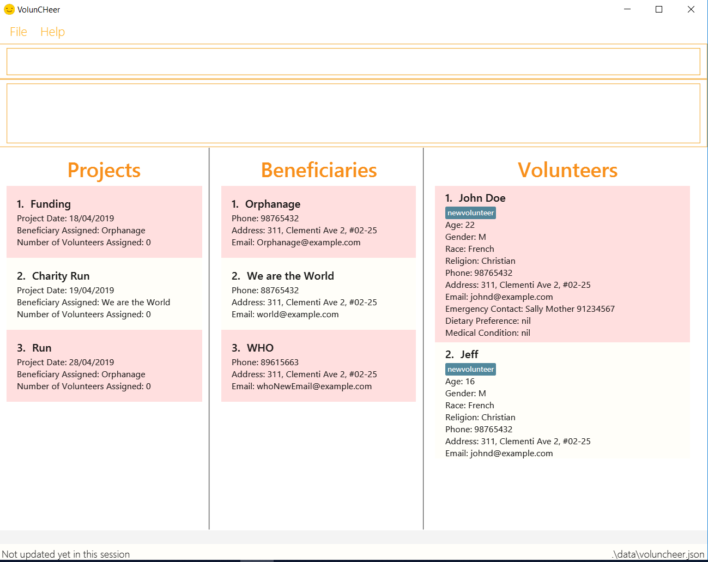

= VolunCHeer
ifdef::env-github,env-browser[:relfileprefix: docs/]

https://travis-ci.com/cs2113-ay1819s2-t08-1/main[image:https://travis-ci.com/cs2113-ay1819s2-t08-1/main.svg?branch=master[Build Status]]
//https://ci.appveyor.com/project/damithc/addressbook-level4[image:https://ci.appveyor.com/api/projects/status/3boko2x2vr5cc3w2?svg=true[Build status]]
//https://coveralls.io/github/se-edu/addressbook-level4?branch=master[image:https://coveralls.io/repos/github/se-edu/addressbook-level4/badge.svg?branch=master[Coverage Status]]
//https://gitter.im/se-edu/Lobby[image:https://badges.gitter.im/se-edu/Lobby.svg[Gitter chat]]

ifdef::env-github[]

endif::[]

ifndef::env-github[]
image::images/Ui.png[width="600"]
endif::[]

Hello! Welcome to VolunCheer, a new desktop volunteer management application. +
This application aims to help project managers within voluntary organisations manage their responsibilities easily.

Features include:

* Easy adding/removing of people/projects
* Calendar to keep track of project dates

For more information, please visit the User Guide below.

== Site Map

* <<UserGuide#, User Guide>>
* <<DeveloperGuide#, Developer Guide>>
* <<LearningOutcomes#, Learning Outcomes>>
* <<AboutUs#, About Us>>
* <<ContactUs#, Contact Us>>

== Acknowledgements
* The original source of the code was adapted from the AddressBook-Level4 project created by SE-EDU initiative at https://github.com/se-edu/
* Some parts of this sample application were inspired by the excellent http://code.makery.ch/library/javafx-8-tutorial/[Java FX tutorial] by
_Marco Jakob_.
* Libraries used: https://github.com/TestFX/TestFX[TextFX], https://github.com/FasterXML/jackson[Jackson], https://github.com/google/guava[Guava], https://github.com/junit-team/junit5[JUnit5]

== Licence : link:LICENSE[MIT]
